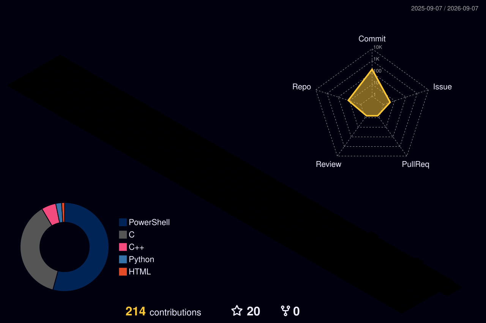

# NHK-DOT / XDXD

**Hohai University Automation 2024 | Robotics Full-Stack Builder**  
**河海大学 2024 级自动化 | 机器人全栈方向**

I build small real robots from CAD, PCB, firmware, control software, vision, and deployment.  
我关注从机械结构、电路、嵌入式、控制、机器视觉到实机部署的完整机器人链路。

---

## Featured Work / 代表项目

### 78arm: Delta arm for UAV / 无人机挂载 Delta 机械臂

  
  
  

- **CN:** 一个面向无人机平台的轻量 Delta 机械臂项目，覆盖结构建模、3D 打印件迭代、LX 总线舵机映射、G-code 到舵机控制、手柄实机控制、AprilTag/IMU 感知和 Jetson 视觉部署。
- **EN:** A lightweight Delta-arm project for UAV-mounted or UAV-tested manipulation, covering mechanical design, printed-part iteration, LX bus-servo mapping, G-code control, gamepad teleoperation, AprilTag/IMU sensing, and Jetson vision deployment.

## Skills by Category / 分类技术栈

| Category | Tools and experience |
| --- | --- |
| **Programming / 编程语言** | C, C++, Python, Go, Kotlin |
| **Operating environments / 操作环境** | Linux, Arch Linux, Ubuntu/Jetson-side development, ROS 1/2 workspaces, server usage and operations |
| **Robotics and motion / 机器人控制** | ROS 1/2, MoveIt, Delta kinematics, G-code motion pipeline, LX bus-servo mapping, serial tools, gamepad teleoperation |
| **Vision and sensing / 视觉与传感** | OpenCV, YOLO, AprilTag, camera calibration, dual-camera hand-eye geometry, WT61C IMU snapshots |
| **Boards and embedded / 板卡与嵌入式** | ESP32, ESP32-S3, ESP8266, STM32 G/H series, STM32MP257, Raspberry Pi 4B, Jetson-side experiments, Waveshare kits |
| **Hardware and manufacturing / 硬件与制造** | SolidWorks, Fusion, JLCEDA, Altium Designer, Bambu Lab A1/P1 series, OrcaSlicer, Bambu Studio, post-processing, metalworking |
| **Application layer / 应用层** | Kotlin Android, Rokid glasses development, PS5 DualSense adaptive trigger experiments, Go backend, personal blog, IoT temperature/humidity web demos |
| **Team and lab / 团队与实验室** | Hohai University Zhize Lab organization, lab management, hardware resource coordination, RoboMaster mechanical and electrical-control experience |

## Project Index / 项目索引

| Project | What it shows | Evidence |
| --- | --- | --- |
| **78arm / UAV Delta arm** | Delta arm hardware, mechanical iteration, LX bus servos, G-code control, AprilTag/IMU sensing, Jetson-side vision experiments | [`delta_on_quadrotorUAV`](https://github.com/NHK-DOT/delta_on_quadrotorUAV) |
| **Personal blog / Go web server** | Blog/web server experiment, web deployment notes, future project documentation entry | [`Go-based-web-server-personal-blog`](https://github.com/NHK-DOT/Go-based-web-server-personal-blog), [`hjc78big.top`](https://hjc78big.top) |
| **Rokid glasses development** | Kotlin/Android-style hardware input testing, gamepad input tester, wearable interaction notes | [`rokid-deploy-record`](https://github.com/NHK-DOT/rokid-deploy-record) remote verified; local repo: `Rokid_Glasses_开发资料` |
| **Service outsourcing competition** | ROS/Gazebo competition material, package rename to `service_outsourcing`, deployment scripts and report materials | [`service_outsourcing`](https://github.com/NHK-DOT/service_outsourcing) remote verified; repo visibility may depend on GitHub access |
| **RoboMaster / navigation work** | ROS 2 navigation workspace, bringup, serial, Livox driver and navigation plugin materials | [`cod_-rm2026_-navigation`](https://gitee.com/codnavgation/cod_-rm2026_-navigation) plus local workspace |
| **Backlog projects** | PS5 adaptive triggers, Waveshare kits, mecanum-wheel chassis, robot-dog experiments, UAV tooling, embedded board notes | To be cleaned and split into public repositories |

## Lab & Team Experience / 实验室与团队经历

- **Hohai University Zhize Lab / 河海大学智泽实验室:** involved in lab management, organization, hardware resource coordination, project documentation, and day-to-day technical support.
- **RoboMaster:** participated as a mechanical group member and electrical-control group member, working across mechanical structure, hardware bring-up, and control-related tasks.
- **Lab photo wall:** planned. I will add selected lab and project photos here after the images are cleaned up and uploaded to the profile repository.

## Open-Source Roadmap / 开源计划

- Split reusable tools from `78arm` into smaller public repositories.
- Clean and publish Rokid, PS5 DualSense, Waveshare, mecanum chassis, robot-dog, UAV, and embedded-board notes when the code and README are ready.
- Keep each repo traceable: hardware assumptions, runnable commands, safety notes, and failure records should stay with the code.

## Backlog to Open Source / 待整理开源方向

These directions are real learning and development tracks, but the repositories still need cleanup before public release:

- **PS5 DualSense adaptive triggers:** trigger force curves, controller I/O, interaction experiments.
- **Waveshare kits:** board bring-up, display/sensor modules, embedded Linux and microcontroller examples.
- **Mecanum-wheel car:** chassis kinematics, low-level motor control, ROS navigation experiments.
- **Robot dog / quadruped:** legged robot structure, servo/control experiments, gait notes.
- **UAV platform:** onboard compute, vision payloads, lightweight manipulator integration.
- **Embedded boards:** ESP32/ESP32-S3, ESP8266, STM32 G/H series, STM32MP257, Raspberry Pi 4B.
- **Android and Rokid glasses:** mobile control UI, wearable interaction prototypes, hardware input testing.

## GitHub Signals / GitHub 公开贡献概览

Current stars from GitHub repositories that are publicly visible through the API: **4**.

  
  

  

## For New Visitors / 给新访问者

If you are interested in robotics, embedded control, machine vision, or real hardware debugging, start from:

- [`delta_on_quadrotorUAV`](https://github.com/NHK-DOT/delta_on_quadrotorUAV): my current main robotics repository.
- [`hjc78big.top`](https://hjc78big.top): my personal site and future project notes.

如果你关注机器人、嵌入式控制、机器视觉或实机调试，可以先看：

- [`delta_on_quadrotorUAV`](https://github.com/NHK-DOT/delta_on_quadrotorUAV)：当前最主要的机器人项目仓库。
- [`hjc78big.top`](https://hjc78big.top)：个人站点，后续会整理更多项目记录。
